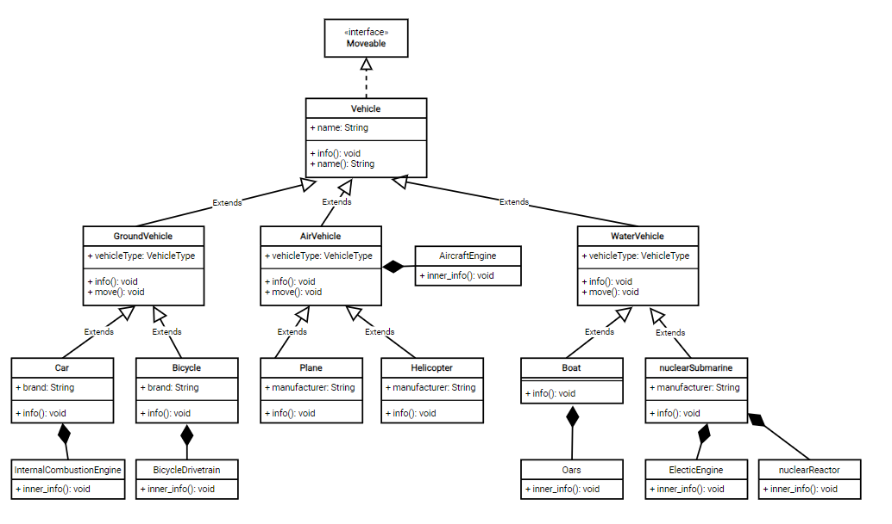

## Описание решения

Абстрактный класс `Vehicle` - начальный класс, который является родителем для остальных классов. Позволяет выводить информацию о транспортном средстве. К нему подключен интерфейс `Moveable`, отражающий обязательство средств передвигаться, с методом `move()`, который переопределится в наследниках в зависимости от типа транспорта.
Абстрактный класс `GroundVehicle` - наследник класса `Vehicle`. Описывает наземный тип транспорта и в соответствии с этим переопределяет тип движения. Абстрактные классы `AirVehicle`, `WaterVehicle` задаются аналогичны.
Также в классе `AirVehicle` задан внутренний класс `AircraftEngine`, описывающий, что воздушные средства перемещения обязаны иметь авиационный двигатель.

Класс `Car` - наследник `GroundVehicle`. Описывает автомобиль, который является наземным типом. Требует наличие двигателя внутреннего сгорания, что отражено внутренним классом `InternalCombustionEngine`.
Класс `Bicycle` - наследник `GroundVehicle`. Описывает велосипед, который является наземным типом. Требует наличие велосипедной трансмиссии для движения, что отражено внутренним классом `BicycleDrivetrain`.

Класс `Plane` - наследник `AirVehicle`. Описывает самолёт, который является воздушным типом.
Класс `Helicopter` - наследник `GroundAirVehicle`. Описывает вертолёт, который является воздушным типом.

Класс `Boat` - наследник `WaterVehicle`. Описывает лодку, которая является водным типом. Требует наличие вёсел, что отражено внутренним классом `Oars`.
Класс `NuclearSubmarine` - наследник `WaterVehicle`. Описывает атомную подводную лодку, которая является водным типом. Требует наличие электродвигателя и ядерного ректора, что отражено внутренними классами `ElectricEngine` и `NuclearReactor`.

## Диаграмма решения

